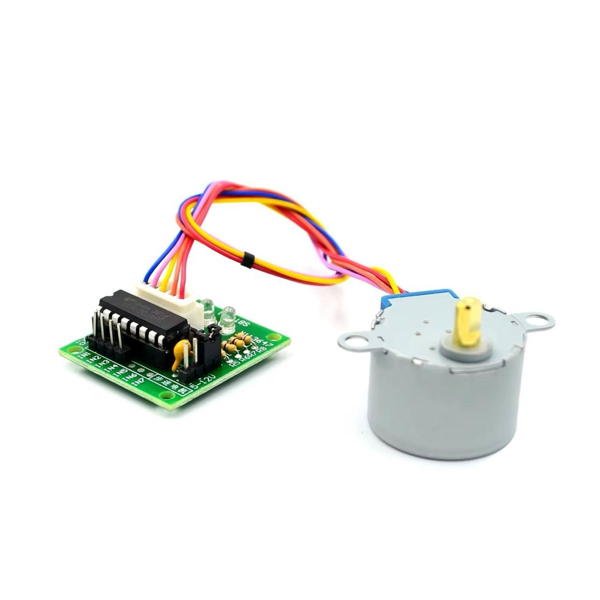
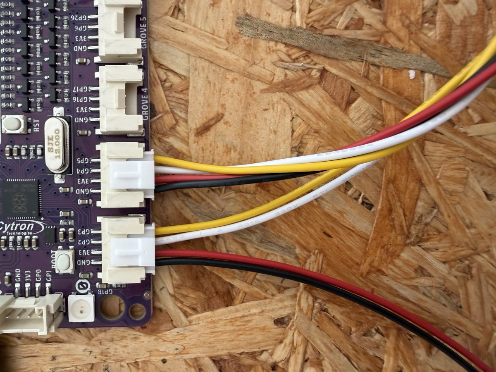
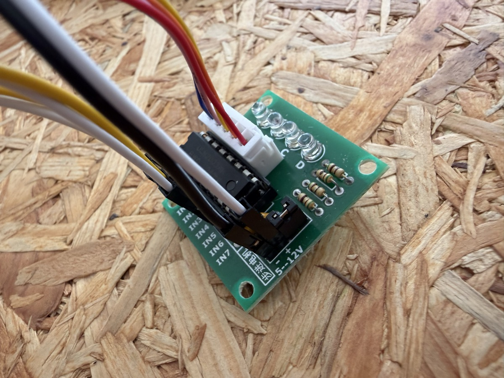
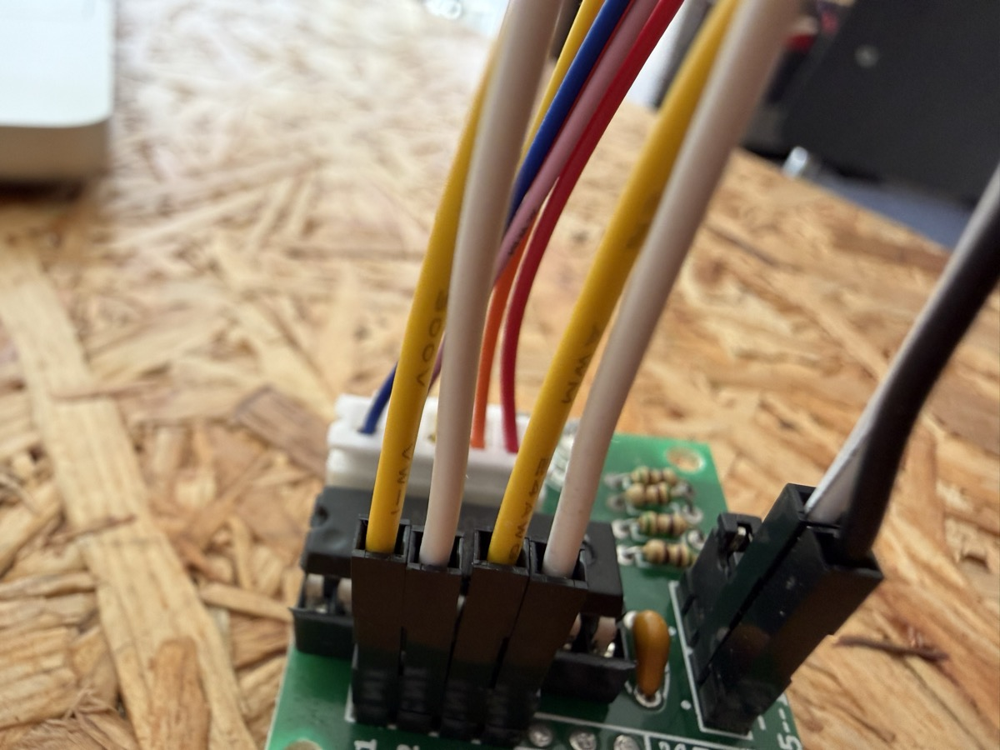

# Schrittmotor (28BYJ-48 + ULN2003)

Dreht einen 28BYJ-48 Schrittmotor präzise um einen Winkel. Eine volle Umdrehung
entspricht 4096 Halbschritten (Motor mit 1:64-Getriebe).

## Verdrahtung

Der ULN2003-Treiber hat vier Eingänge **IN1–IN4**, angesteuert über zwei Grove-Ports:

- **Anschluss 1** → IN1 (Pin 1) und IN2 (Signalpin)
- **Anschluss 2** → IN3 (Pin 1) und IN4 (Signalpin)

> **5 V Versorgung:** Die Grove-Ports liefern nur ein 3,3-V-Signal. Die
> Stromversorgung (**5 V + GND**) des ULN2003 wird extern vom **Servo-Header**
> des Boards abgegriffen. Generator: siehe `js/generator.js`.

## Foto-Anleitung

So sieht das komplette Set aus Treiberboard und 28BYJ-48-Schrittmotor aus:

Die beiden Grove-Kabel (Anschluss 1 und Anschluss 2) werden an zwei benachbarte Grove-Ports des Boards angeschlossen:

Die Kabel führen gemeinsam zum Eingangsstecker des ULN2003-Treiberboards. Die Motorspannung (5–12 V) kommt separat über die Schraubklemme:

Auf der anderen Seite des Treiberboards führt die Leitung weiter zum Schrittmotor:

<!-- lang:en -->

# Stepper motor (28BYJ-48 + ULN2003)

Turns a 28BYJ-48 stepper motor precisely by an angle. One full revolution
equals 4096 half steps (motor with 1:64 gearbox).

## Wiring

The ULN2003 driver has four inputs **IN1–IN4**, driven via two Grove ports:

- **Connector 1** → IN1 (pin 1) and IN2 (signal pin)
- **Connector 2** → IN3 (pin 1) and IN4 (signal pin)

> **5 V supply:** the Grove ports only provide a 3.3 V signal. The power
> supply (**5 V + GND**) of the ULN2003 is taken externally from the board's
> **servo header**. Generator: see `js/generator.js`.

## Photo guide

This is the complete set of driver board and 28BYJ-48 stepper motor:

Both Grove cables (connector 1 and connector 2) are plugged into two neighboring Grove ports on the board:

The cables lead together to the input connector of the ULN2003 driver board. The motor voltage (5–12 V) comes in separately via the screw terminal:

On the other side of the driver board, the wiring continues to the stepper motor:

