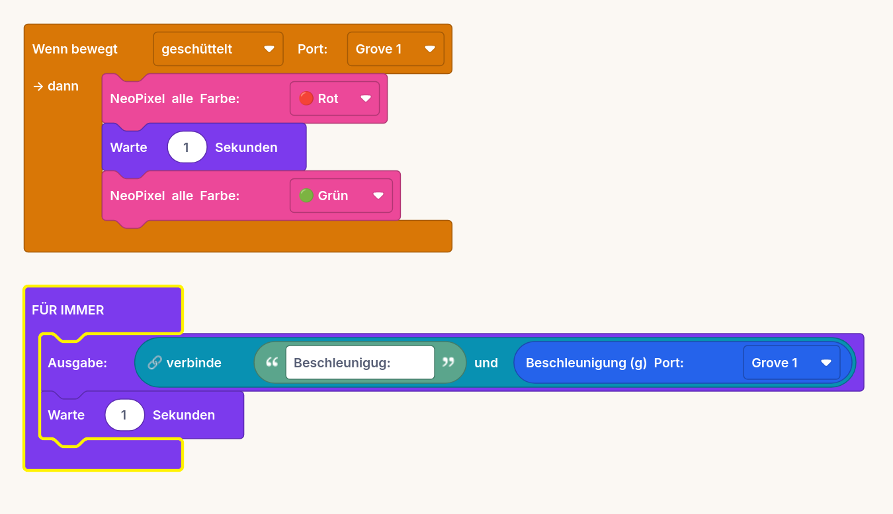

# ICM20948 – Beschleunigung (g)

Liefert die Gesamt-Beschleunigung als Zahl in g. In Ruhe zeigt der Sensor ≈ 1,0
(Erdanziehung), beim Schütteln oder Aufprall deutlich mehr. Messbereich: bis ±16 g.

## Beispiel

Beim Schütteln leuchten die NeoPixel kurz rot, parallel wird der g-Wert jede Sekunde ausgegeben:

> Benötigt `adafruit_icm20x.mpy` und `adafruit_register/` auf `CIRCUITPY/lib/`
> (Adafruit CircuitPython Bundle). Anschluss über Grove-I2C-Adapter, Adresse 0x69.
