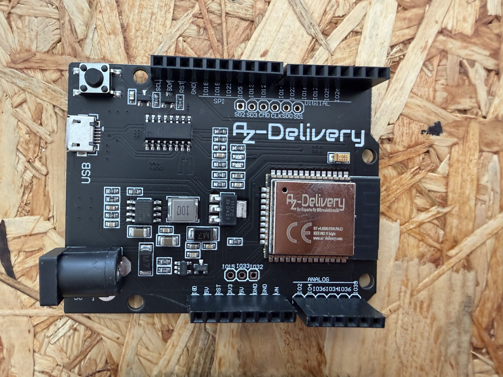
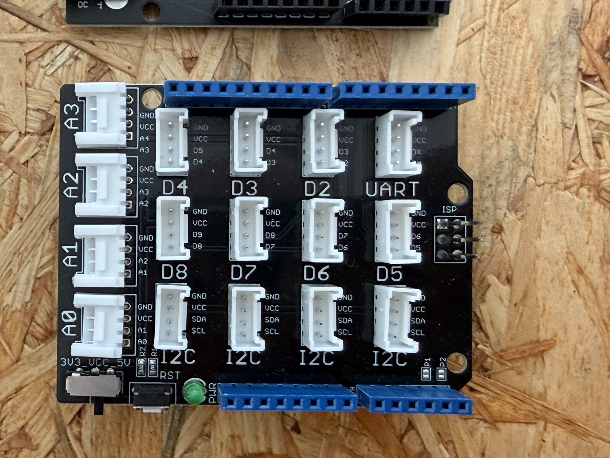

# ESP32 D1 R32 mit Grove Base Shield

Anleitung für das AZ-Delivery **ESP32 D1 R32** (ESP32-WROOM-32 im Arduino-Uno-Formfaktor, CH340-USB-Seriell) mit aufgestecktem **Grove Base Shield** – Board-Profil `esp32_d1_r32` im Editor.





## Flashen

Vorab: Einen Boot-Taster gibt es nicht und man braucht ihn auch nicht – esptool aktiviert den Bootloader automatisch über die CH340-Auto-Reset-Schaltung. `esptool` installieren mit `pipx install esptool` (oder `pip install esptool`). Der serielle Port heißt am Mac z.B. `/dev/tty.usbserial-10` (`ls /dev/tty.usbserial*`). **Wichtig:** Vorher im Editor/Thonny trennen, sonst ist der Port belegt. Bei Übertragungsfehlern („serial noise/corruption") die Baudrate weglassen (Standard 115200) – der CH340 mag hohe Baudraten nicht immer.

### Weg 1: Fertiges makerSpaceOS-Image (empfohlen)

`firmware/makerSpaceOS_firmware_esp32-d1-r32.bin` ist ein kompletter 4-MB-Flash-Dump: **CircuitPython 10.2.1 (deutsch) inklusive aller Libs** aus `lib/` – ein Schritt, fertig:

```bash
esptool --port /dev/tty.usbserial-10 erase-flash
esptool --port /dev/tty.usbserial-10 --baud 460800 write-flash -z 0x0 firmware/makerSpaceOS_firmware_esp32-d1-r32.bin
```

### Weg 2: Original-CircuitPython + Libs von Hand

1. Build **„DOIT ESP32 DevKit V1"** von [circuitpython.org](https://circuitpython.org/board/doit_esp32_devkit_v1/) herunterladen (es gibt keinen offiziellen D1-R32-Build; dieser generische passt) und flashen:

   ```bash
   esptool --port /dev/tty.usbserial-10 erase-flash
   esptool --port /dev/tty.usbserial-10 --baud 460800 write-flash -z 0x0 adafruit-circuitpython-doit_esp32_devkit_v1-de_DE-10.2.1.bin
   ```

2. **Runtime-Libs kopieren**: Der klassische ESP32 hat **kein natives USB**, daher erscheint **kein `CIRCUITPY`-Laufwerk** im Finder/Explorer. Den kompletten Inhalt von `lib/` aus dem Repo per **Thonny** kopieren: Ansicht → Dateien, dann auf das Gerät nach `/lib/` ziehen.

### Image selbst neu erzeugen

Nach Lib-Updates den Flash eines fertig eingerichteten Boards zurücklesen (115200 ist hier absichtlich – höhere Baudraten brechen beim CH340 gern ab, dauert ~6 min):

```bash
esptool --port /dev/tty.usbserial-10 read-flash 0 0x400000 firmware/makerSpaceOS_firmware_esp32-d1-r32.bin
```

## Einrichtung

1. Flashen (siehe oben).
2. **VCC-Schalter des Shields auf 3V3 stellen!** Die ESP32-GPIO sind nicht 5-V-tolerant.
3. Im Editor verbinden – die Auto-Erkennung (`board_id: doit_esp32_devkit_v1`) schaltet selbst auf das Profil „ESP32 D1 R32 (Uno)" um.

## Port-Übersicht

Der Shield-Aufdruck (D2…D8, A0…A3, I2C) entspricht den Uno-Pin-Namen – **nicht** den ESP32-GPIO-Nummern. Ein Grove-Port `Dn` führt zwei Signale: Uno-`Dn` (gelbe Ader = Signal) und Uno-`Dn+1` (weiße Ader). Benachbarte D-Ports teilen sich dadurch einen Pin – nicht zwei nebeneinanderliegende Ports gleichzeitig belegen.

| Grove-Port (Shield) | Signal (gelb) | 2. Ader (weiß) | Hinweis |
|---|---|---|---|
| A0 | GPIO2 (`board.D2`) | GPIO4 | GPIO2 = Onboard-LED |
| A1 | GPIO4 (`board.D4`) | GPIO35 | |
| A2 | GPIO35 (`board.D35`) | GPIO34 | **nur Eingang** |
| A3 | GPIO34 (`board.D34`) | GPIO36/VP | **nur Eingang** |
| I2C (4×) | SCL = GPIO22 | SDA = GPIO21 | alle 4 Buchsen parallel |
| UART | GPIO1/GPIO3 | | belegt durch USB-Seriell – im Editor nicht angeboten |
| D2 | GPIO26 (`board.D26`) | GPIO25 | |
| D3 | GPIO25 (`board.D25`) | GPIO17 | |
| D4 | GPIO17 (`board.D17`) | GPIO16 | |
| D5 | GPIO16 (`board.D16`) | GPIO27 | |
| D6 | GPIO27 (`board.D27`) | GPIO14 | fester Summer-Ausgang |
| D7 | GPIO14 (`board.D14`) | GPIO12 | GPIO12 = Strapping-Pin |
| D8 | GPIO12 (`board.D12`) | GPIO13 | GPIO12 = Strapping-Pin |

- **Nur Eingänge** (GPIO34/35/36/39): Taster, PIR und analoge Sensoren funktionieren, aber keine LEDs, kein Summer, kein Ultraschall.
- **Servos** S1–S4 liegen auf den Grove-Ports D2/D3/D4/D5.
- Onboard: keine Taster (nur EN = Reset), kein NeoPixel, kein Motortreiber – die entsprechenden Blöcke sind bei diesem Profil ausgeblendet.
