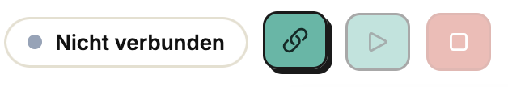
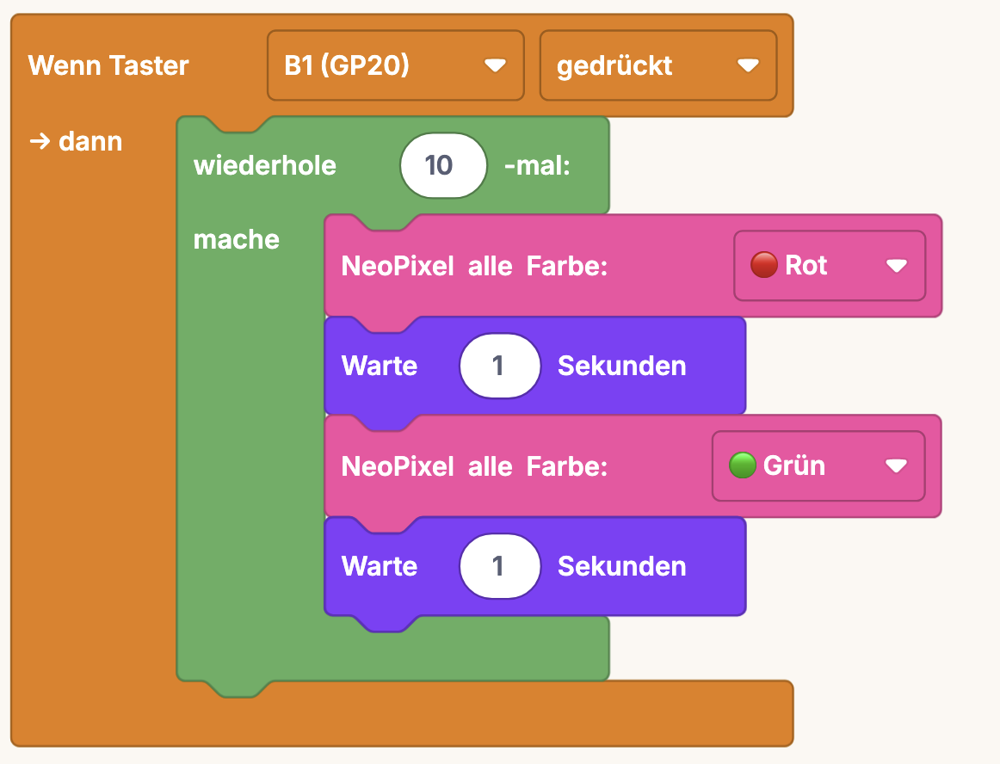

# makerSpaceOS – Erste Schritte

*Zum Reinlegen in die Kit-Box. Für Betreuende (Lehrkraft/AG-Leitung) – gerne
laut vorlesen oder mit den Kindern zusammen durchgehen.*

---

## 1. Ausprobieren – ganz ohne Programmieren

Im Karton liegt der Maker-Pi schon fertig verkabelt: Programm und Batterie
sind schon drin, es kann direkt losgehen.

1. **Einschaltknopf drücken.**
2. **Ausprobieren, was die Bauteile können:**
   - Am **Drehgeber** drehen
   - Die Hand vor den **Ultraschallsensor** halten
   - Auf den **DHT-Sensor** pusten (Temperatur/Luftfeuchte)

   > Schau dabei auf die Anzeigen und Lichter am Board – was verändert sich?
   > *(Betreuende: hier kurz notieren, was das mitgelieferte Testprogramm
   > konkret zeigt, damit die Kinder wissen, worauf sie achten sollen.)*
3. **Mehr wissen?** Zu jedem Bauteil im Deckel gibt's einen QR-Code mit einer
   kurzen Erklärung – einfach mit dem Handy draufhalten.

---

## 2. Selbst programmieren

### Schritt 1 – Board anschließen
Maker-Pi per USB-C-Kabel mit dem Computer verbinden.

### Schritt 2 – Editor öffnen
**Chrome oder Edge** öffnen (andere Browser können nicht auf das Board
schreiben). `mos.kidslab.de` aufrufen und auf **„Editor öffnen"** klicken.

### Schritt 3 – Verbinden
Oben rechts auf **„Verbinden"** klicken und das Board in der Liste auswählen.

### Schritt 4 – Beispiel nachbauen
Dieses kleine Programm aus Blöcken zusammenstecken: Taster gedrückt →
NeoPixel wechselt 10× zwischen Rot und Grün.

### Schritt 5 – Ausführen
Auf **„Ausführen"** klicken und schauen, was passiert.

---

*makerSpaceOS – ein Projekt der KidsLab – Digitale Bildung gGmbH · kidslab.de*
